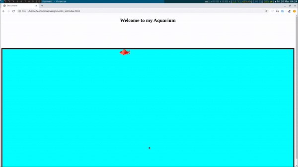

# JS Bootcamp (Continued..)

|<span style="font-size:20px;">Table of Contents</span>|
|-----------------|
|1. [Objects](#objects)|
|2. [Events](#events)|
|3. [JS DOM](#js-dom)|
|4. [JS BOM](#js-bom)|
|4. [Something useful](#something-useful)|
|5. [Assignment](#assignment)|
|6. [Reference](#reference)|(

<!--  -->

## Objects

* Every type can be of type `object`.

* JS objects are `mutable`

* This `object` concept comes from concept called [**object oriented programming** ](https://www.webopedia.com/TERM/O/object_oriented_programming_OOP.html)

* every other types can be made to `object` type

* `boolean`, `number`, `string` type can be made `object` type by initializing the `construtor` of that type with `new` keyword.

**Let us discuss**

```javascript
    // sting literal
    var myName = "Jesse";
    console.log(typeof myName); // You know the type is string by now
    
    // string object
    var myVar = new String("Jesse");
    console.log(typeof myVar); // object type 
```
> :notebook: Now you might have noticed how the string literal and string object. Which is preferable ?. String lierals is more preferable. Find why it is so.

**So can you make a number object now?**

```javascript
    //number literals
    var weight=78;
    console.log(typeof weight);// number type

    //number object
    var weightObj=new Number(78);
    console.log(typeof weightObj); //object type

```
> :notebook: Make `boolean` object type by yourself.

**How to make an object?**

* `object` literal can be created by using `{}`

### Method 1

```javascript
    var myObject = {
        name:"Dude",// This is the property of myObject object
        age:"56",// This also is the property of myObject object
        getDetails:function(){// you know what is this right
            return `${this.name} ${this.age}`// This string templating
        }
        }

    console.log(myObject.name)//prints Dude
    console.log(myObject.age)//prints 56
    console.log(myObject.getDetails())//prints Dude 56

```

> :notebook: You can see the `key`:`value` pairs inside the `object`.
This is the basis of an `object` creation. Make an object by yourself.

> :notebook: What's use of `this` keyword ?. Find out when and where to use `this` keyword. `this` will come handy.

* `object` type can be created by using `new` keyword with `constructor` invoked

### Method 2

```javascript
    var myObject = new Object();// a new object is created using new keyword
    myObject.name = "Dude"; // name property is added to object
    myObject.age = 45; // age property is added to object
    myObject.getDetails = function(){return `${this.name} ${this.age}`}

    console.log(myObject.name)// No explanation is needed right
    console.log(myObject.age) //No explanation is needed right
    console.log(myObject.getDetails())

```
> :notebook: `constructor` is invoked by its **name** followed by **( )** .
<br>Eg: `Object` is the `constructor` name and `()` invokes the constructor

> :notebook: you can also assign value like `myObject["name"]="foo;"`and `console.log(myObject["name"])` gives `foo` but `not recommended` 

### Method 3

* You might have wondered how `String()`,`Number()`,`Object()` etc. is created

**Let us see how to create a function constructor**

```javascript
    function Person(name,age){
        this.name = name; 
        this.age = age;
        this.getDetails = function(){
            return `${this.name}  ${this.age}`
        }
    }

    // How to initialize a Person object
    var person = new Person("dude",50);// Person constructor takes two parameters i.e name and age 
    console.log(person.name)// Guess the output
    console.log(person.age)// Guess the output
    console.log(person.getDetails())// Guess the output

```
> :notebook: `this` points to the current object instance. so `this.name` becomes a property of the object

### Method 4

* if you are familiar with `class` concept this will be a better fit for you.

```javascript
    class Person{
        constructor(name,age){
            this.name = name;
            this.age = age;
        }
        getDetails(){
            return `${this.name} ${this.age}`
        }
    }

    // How to initialize a Person object
    var person = new Person("dude",50);// Person constructor takes two parameters i.e name and age 
    console.log(person.name)// Guess the output
    console.log(person.age)// Guess the output
    console.log(person.getDetails())// Guess the output
```

> :notebook: Did you notice that `getDetails` function doesn't have a `function` keyword infront of it ?.inside class `function` keyword is not needed for a member function. 

> :notebook: Special function `constructor()` is used to initialize the items of the `object`.[Refer MDN](https://developer.mozilla.org/en-US/docs/Web/JavaScript/Guide/Working_with_Objects) to learn more about objects.

> [See more examples](https://codesandbox.io/s/objects-su5wg)

## Events

* HTML elements can trigger an `event` when something happens to HTML elements<br>
Eg: A button click,Finish loading webpage .

* The `events` are predefined

**Let us discuss common HTML events**

|Event|Description|
|--- |--- |
|onchange|An HTML element has been changed|
|onclick|The user clicks an HTML element|
|onmouseover|The user moves the mouse over an HTML element|
|onmouseout|The user moves the mouse away from an HTML element|
|onkeydown|The user pushes a keyboard key|
|onload|The browser has finished loading the page|

**How we handle this events ?**

Answer is JavaScript

**How we set event handler for a HTML element ?**

**Let's discuss with an example**

```html
<body>

<button onclick="displayAlert()">click here</button>

<script>
function displayAlert(){
    alert('Hello word')
    // some more code
    }
</script>
</body>

```

**or**

```html
<button onclick="alert('Hello world')">click here</button>
```

**or**

```html
<button onclick="(()=>{
    alert('Hello world');
    console.log('Hello world');
    //more statements
    })()">click here</button>
```

> :notebook: In the above example `onclick` event is triggered when user clicks on the button. You have to give some JS code between the double quotes.(in this example the script is included in  the same HTML page itself)

> :notebook: `alert` is a browser spefic function. It produces an alert dialog with given input string.

> :notebook: you can invoke a `arrow function` or `function expression` by enclosing the same inside a `()` and invoke it `()`.How this is helpful ?. You can write a piece of code there itself.

**Take a look at other type of events called**

**Timing events**

1. `setTimeOut()`: helps to run a piece of code after a given time interval specified in seconds.

    ```javascript
        setTimeOut(()=>{
            console.log("Executed after one second");
        },
        1000)
    ```

2. `setInterval()`: helps to run a piece of code repeatedly

    ```javascript
        setInterval(()=>{
            console.log("I will repeat after 1 second");
        },
        1000)
    ```

> [See more examples](https://codesandbox.io/s/events-k86r6)

## JS DOM

* DOM stands for **Document object Model**

* DOM helps the programmer to dynamically access and update the content of the document.

* Any changes in the pages can done using `DOM`.

**Concept in DOM**

* HTML elements are considered as `objects` in `DOM`.

* These `objects` have `properties` and `methods` which helps to alter the HTML elements.  

* `events` can be added to elements by `DOM`

**In short**

The HTML DOM is a standard for how to **get**, **change**, **add**, or **delete** HTML elements.

**Let us discuss how to access elements using JS**

```html
<div id="my-div"></div>

<script>
    var myDiv = document.getElementById("my-div"); 
    /*
    we can access any element by this way. document object holds all the html elements. we can access with their id or class name or tag name
    */    
</script>
```

**Adding a html tag inside the div**

```javascript
myDiv.innerHTML ="<h1>Welcome back</h1>" // A h1 tag will be added to the div
```

**Adding an event to the div**

* `events` take a function reference keep that in mind.

```javascript
myDiv.onclick = ()=> {myDiv.innerHTML="<h1>Hai.</h1>"} //Arrow function

myDiv.onmouseenter = ()=>{console.log("Mouse entered on the element");// Look in the console

```

**Changing the style of the div**

* HTML element object has a `style` object which has different `properties`.

```javascript
myDiv.style.color="red"; // refer css attributes

myDiv.style.border="green solid 2px" //Another example
```

**Every element is considered as a node**

**Let's discuss how to `create`,`remove`,`add` nodes using JS**

### 1. Creating new nodes

|Property/Method|Description|
|--- |--- |
|createElement()|Create a new element node|
|createTextNode()|Create a new text node|
|node.textContent|Get or set the text content of an element node|
|node.innerHTML|Get or set the HTML content of an element|

```javascript
    let mDiv = document.createElement('div');//here mDiv is the node name 
    console.log(mDiv)// gives out <div></div>
```

### 2.Inserting nodes

|Property/Method|Description|
|--- |--- |
|node.appendChild()|Add a node as the last child of a parent element|
|node.insertBefore()|Insert a node into the parent element before a specified sibling node|
|node.replaceChild()|Replace an existing node with a new node|

```javascript
//Example of appending child to a parent node
let rootElement = document.querySelector('ul');

let li =document.createElement('li')
li.textContent='New item';

rootElement.appendChild(li)

```

### 3.Removing nodes from DOM

|Method|Description|
|--- |--- |
|node.removeChild()|Remove child node|
|node.remove()|Remove node|

> [See more examples](https://codesandbox.io/s/dom-qtc6n)

> :notebook: [Refer W3Schools](https://www.w3schools.com/js/js_htmldom_document.asp) to learn more about `DOM`.

## JS BOM


* `BOM` stands for `Browser Object Model`

* `BOM` has no standards when comparing with `DOM`

* **`DOM` has `document` object where `BOM` has `window` object**.

**Let's us discuss about BOM**

**Work these out in the console**

```javascript
window.innerHeight //inner Height of browser window
window.innerWeight //inner Weight of browser window
```

**`window`object methods - control your browser**

```javascript
window.open(); // open a  new window
window.close(); //close the window
window.moveTo(); //move the current window
window.resizeTo(); //resize the current window
```

**`window` has objects as properties**

1. `window.screen`
2. `window.location`
3. `window.history`

**Some of the properties are given below**

1. `window.screen`

    ```javascript
    window.screen.width // returns the width of the user's screen in pixels.
    window.screen.height // returns the height of the user's screen in pixels.
    ```

2. `window.location`

    ```javascript
    window.location.href; //returns the href (URL) of the current page. you can assign hyperlink reference too

    window.location.hostname;// returns the domain name of the web host. 
    //Take a site other than google and do this
    window.location.hostname="www.google.com" // browser reloads to google right? 
    ```

3. `window.history`

    ```javascript
    window.history.goBack(); //guess the outcome

    window.history.goForword(); //guess the outcome
    ```

> [See more examples](https://codesandbox.io/s/jsbom-109q2)

> :notebook: [Refer W3Schools](https://www.w3schools.com/js/js_window.asp) to learn more.


## Something useful

**Convert string to number type**

1. `parseInt()`: used to parse integer from string.

    ```javascript
        let num1 = parseInt("56");// obtains 56
        let num2 = parseInt("56.7");// obtains 56
        let num3 = parseInt("nah");// cannot be parsed .returns NaN 
    ```

2. `parseFloat()`: used to parse floating point number from a string.

    ```javascript
        let num = parseFloat("56.7");// obtains 56.7
        let num = parseFloat("nah");// cannot be parsed .returns NaN 
    ```

> For knowing about good practices in JS [Refer Airbnb ](https://github.com/airbnb/javascript) github repository

# Assignment

### Problem Statement:

**" Make an aquarium with a fish in it. Fish should move from left to right and back to initial position. And this should cotinue inifite times "**



### Hints:

* Make a html page.

* Add a image of fish using `` tag

* Use `setInterval()` with `.5` seconds.

* Get the fish HTML element by `getElementById()`

* Set the css attribute `position` to `absolute`

* Get the position of the fish by using `fish.getBoundingClientRect().left`

* Add `5px` to `fish.style.left` . So the fish moves right.

* To Flip your fish `fish.style.transform="scaleX(-1)"`
* Rest. Do it yourself

## Reference

1. [W3Schools](https://www.w3schools.com/)

2. [MDN](https://developer.mozilla.org/en-US/)

### **So thats it...**

